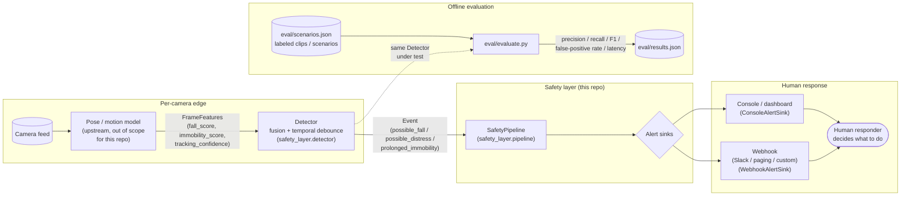

# Architecture

GuardianMesh — privacy-preserving AI for recognizing human distress. Detect
the emergency, not the identity.

## System diagram

## Why the boundary is where it is

The safety layer starts at **derived per-frame scores**, not raw pixels. Two
reasons:

1. **Separation of concerns.** Pose estimation / motion tracking is a
   separate, swappable component (a model, a vendor SDK, a different camera
   stack). The safety layer's job — fuse signal over time, debounce noise,
   decide when a human should be paged — doesn't need to change when that
   upstream model changes.
2. **Privacy.** Only scores cross the boundary into the alerting/eval/
   dashboard side of the system, not video.

## Core components

| Component | File | Responsibility |
|---|---|---|
| `Event` | `src/safety_layer/event.py` | The validated wire format every consumer agrees on (see `schema.json`). |
| `FrameFeatures` | `src/safety_layer/detector.py` | Input contract from the upstream vision model. |
| `Detector` (`MockFallDetector`) | `src/safety_layer/detector.py` | Fuses scores, requires a sustained window before firing, applies a cooldown so one event can't spam. |
| `SafetyPipeline` | `src/safety_layer/pipeline.py` | Wires a detector to N alert sinks; the thing integration tests exercise end-to-end. |
| `AlertSink` implementations | `src/safety_layer/alerting.py` | Where events go: console (demo), in-memory (tests/eval), webhook (real integration). |
| Evaluation harness | `eval/` | Replays labeled scenarios through the real detector/pipeline and reports precision/recall/F1/latency. |

## Why debouncing matters here specifically

The single biggest product risk for this category of system is **alert
fatigue**: if responders get paged for shoe-tying and couch-sitting, they
stop trusting (and stop responding to) the system. `MockFallDetector`
requires the fused signal to stay above threshold for several consecutive
frames *and* respects a cooldown window before firing again — see
`eval/scenarios.json` for the specific false-positive cases (tying a shoe,
sitting down quickly, occluded tracking) this is tuned against.

## Extending this for a real deployment

- Swap `MockFallDetector` for a model-backed detector that still implements
  the same `Detector.process_frame(FrameFeatures) -> Optional[Event]`
  interface — nothing downstream needs to change.
- Point `eval/dataset.py` at a manifest built from real recorded, labeled
  clips instead of `eval/scenarios.json` (see `docs/TEST_VIDEOS.md`).
- Add a persistent `AlertSink` (e.g. writing to a real dashboard's database,
  or paging via SMS) alongside or instead of `WebhookAlertSink`.
